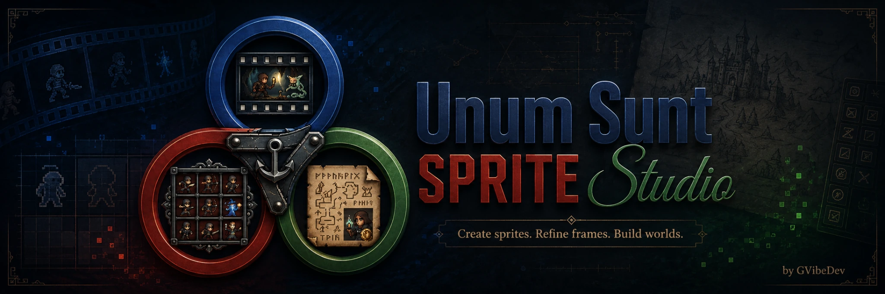

<p align="center">
  
</p>

# Unum Sunt Sprite Studio

**Local production workstation for turning generated images, videos, frame sequences and spritesheets into usable 2D game assets.**

**Current application baseline:** R5c8 · Windows x64  
**Core license:** GNU GPL-3.0-or-later  
**Release status:** international Windows release candidate  

Unum Sunt Sprite Studio is not a one-click “perfect sprite” generator. It is a production suite built around the opposite assumption: generative models drift, ignore instructions, create artifacts, deform details and often need selection, clean-up, alignment and calibration before their output becomes useful.

**Sprite Studio gives you control over that process.**

The suite can start from a generated image, an existing image, a video, a frame sequence or a complete spritesheet, and it can move those assets through generation, extraction, clean-up, alignment, organization and export. Built-in workflows are recommendations, not restrictions: every major workspace remains directly accessible.

> **More control, not more promises.**  
> The goal is not to hide generative complexity. The goal is to make it observable, reusable and recoverable.

---

## What you can do

- build structured prompts with reusable prompt profiles;
- generate still images through a local Krea 2 / WanGP workflow;
- animate reference material through WanGP / Wan Animate;
- import existing videos and extract candidate frames;
- select usable frames instead of discarding an entire imperfect generation;
- remove or refine backgrounds and masks with automatic and manual clean-up tools;
- propagate selected clean-up operations across compatible frames;
- align frames into consistent animation-ready sequences;
- import and decompose existing spritesheets;
- build new reference sheets from existing sprite material;
- organize subjects, animations, eight directions and logical layers;
- compare generation runs in the Calibration Lab;
- preserve successful configurations with profiles and Production Presets;
- export cleaned frame sequences and spritesheets;
- use built-in offline Help for Quick Start, production workflow, Local AI, controls and licensing.

### Flexible entry points

| Start with | Typical direction |
| --- | --- |
| A text concept | Prompt Builder → Image Generation → Motion → Extraction → Clean-up → Alignment → Export |
| An existing image | Reference → Motion → Extraction → Clean-up → Alignment → Export |
| An existing video | Extraction → Frame selection → Clean-up → Alignment → Export |
| A frame sequence | Clean-up / Alignment → Character Set → Export |
| An existing spritesheet | Decompose → Refine → Build reference → Optional generation → Export |
| A partially completed character set | Organize / complete directions → refine missing assets → Export |

See [Recommended Workflows](docs/WORKFLOWS.md) for concise step-by-step routes.

---

## R5c8 — International Release UX

R5c8 keeps the R5c7 production architecture and prepares the application for international public distribution.

The main changes are:

- English public application UI and user-visible diagnostics;
- built-in offline **Help** menu;
- Windows product identity advanced to `R5c8 / 5.8.0.0`;
- R5c8 Setup, Standalone and Corresponding Source release wiring;
- GPL presented in Setup as an informational open-source notice instead of a click-through agreement;
- `OPEN_SOURCE_LICENSE_NOTICE.txt` included in the public distribution;
- Krea 2 and Miniconda/Anaconda acceptances kept separate and explicit for optional third-party components;
- multi-resolution Windows icon contract checked automatically.

The automated R5c8 regression currently passes **329 tests** plus `compileall`. Manual Windows release gates must still be completed before tagging/publishing the final binaries.

See [Release Notes R5c8](RELEASE_NOTES_R5c8.md) and [Public Release Checklist R5c8](PUBLIC_RELEASE_CHECKLIST_R5c8.md).

---

## Built for production, not only generation

A good generation is only the beginning of a usable asset pipeline.

Sprite Studio was designed to preserve the parts of a generation that work and give you tools for the parts that do not. A video with several bad frames is not automatically a failed video. A useful frame with a contaminated edge is not automatically a lost frame. A slightly unstable sequence can often be improved through selection, clean-up and alignment.

That is why the suite includes production systems around the generators rather than treating generation as the final output:

- **Prompt Builder** — modular prompt construction, technical constraints and identity-preservation guidance;
- **Calibration Lab** — compare runs, isolate parameter changes and preserve useful baselines;
- **Profiles and Production Presets** — keep configurations that actually worked on your hardware and material;
- **Extraction** — choose the useful temporal material instead of accepting every frame;
- **Clean-up** — automatic keying plus manual correction, selection tools, propagation and transaction history;
- **Alignment** — normalize frame placement before animation export;
- **Sprite Sheet tools** — decompose existing work or turn it back into reference material;
- **Character Set / Layer Manager** — organize production by subject, animation, direction and layer;
- **Guided Workflows** — optional routes through the suite without locking you into one way of working.

---

## Local AI: important expectations

Sprite Studio can manage local AI workflows, but local generative AI is **hardware-intensive, configuration-sensitive and probabilistic**.

You should expect substantial disk usage, generation speed to vary with model/settings/hardware, and some outputs to contain artifacts or drift. Calibration is part of the production workflow rather than a one-time setup step.

A complete managed local setup should be planned around **approximately 100 GB of free disk space**, with additional room recommended for projects, cached assets and generated media. The current runtime plan reserves roughly 86.7 GiB before safety margin and future workspace growth.

There is intentionally no single published “minimum VRAM” or “minimum RAM” number for every workflow. WanGP uses different memory/offload profiles, and workloads change substantially with the selected model and generation parameters. A configuration that technically runs can still be too slow for practical production.

For details, read [AI Runtime & Hardware](docs/AI_RUNTIME_AND_HARDWARE.md).

---

## Local model workflows

Sprite Studio currently targets local workflows around:

- **WanGP / Wan2GP** as a separately installed or adopted external runtime;
- **Wan 2.2 Animate** for reference-driven motion generation;
- **Krea 2 Turbo** for local image generation.

These components are not part of the GPL-covered Sprite Studio Core and remain subject to their own terms.

The project does **not** claim parity with the newest proprietary cloud image/video systems in speed, infrastructure or every aspect of output quality. The target is a repeatable, reference-driven local 2D production workflow where control, iteration and recovery matter.

### Krea 2

Krea 2 is optional and separately licensed. Sprite Studio requires explicit policy acknowledgement before Krea generation and manual review before a newly generated Krea image can be promoted into the WAN reference pipeline.

Read:

- [KREA_SAFETY_AND_USE.txt](KREA_SAFETY_AND_USE.txt)
- [Krea 2 Community License](https://www.krea.ai/krea-2-licensing)
- [Krea Acceptable Use Policy](https://www.krea.ai/krea-2-use-policy)

### WanGP

WanGP remains an external runtime and is not sublicensed by Sprite Studio. Review the current upstream WanGP license before changing the distribution or monetization model. See [THIRD_PARTY_NOTICES.txt](THIRD_PARTY_NOTICES.txt).

---

## Generation is a craft, not a button

Common causes of poor output include contradictory prompts, low-quality or already-deformed source material, complex backgrounds, excessive detail, and aggressive combinations of resolution/frame count/settings.

The practical approach is iterative: stabilize the source, change one important variable at a time, compare runs, preserve working profiles and use clean-up/alignment to recover imperfect but valuable material.

See [Generation Guide](docs/GENERATION_GUIDE.md).

---

## Designed with small game teams in mind

Sprite Studio was conceived for **retro, indie, roguelike/roguelite and sprite-heavy 2D production**, where a small team may need many characters, directions, variants and animation states without a large dedicated animation department.

A well-calibrated suite can reduce repetitive asset-preparation time so that more development time can be spent on gameplay, level design, balancing, writing, audio and polish.

Props, effects, animated textures and other frame-based 2D material are plausible experimental uses, although not every such workflow has been formally validated yet.

---

## Visual tour

The public documentation is being updated with three R5c8 production captures:

1. **Image Generation** — a real local generation with its output visible;
2. **Clean-up** — a generated frame being repaired and prepared for production;
3. **Character Set / Layer Manager** — a multi-direction production set organized for export.

See [Screenshot Plan](docs/SCREENSHOT_PLAN.md).

---

## Installation and source builds

The **Core application** can be used without installing any AI runtime. Local AI features are optional.

Canonical Windows build commands:

```text
build_windows_standalone.bat
build_setup_windows.bat
```

Public release assembly helper:

```text
PREPARE_PUBLIC_RELEASE_R5C8.bat
```

The `R5c7` Git tag remains the frozen validated baseline that R5c8 builds upon. R5c8 should receive its own tag only after the manual Windows release checklist passes.

---

## Documentation

- [Recommended Workflows](docs/WORKFLOWS.md)
- [Generation Guide](docs/GENERATION_GUIDE.md)
- [AI Runtime & Hardware](docs/AI_RUNTIME_AND_HARDWARE.md)
- [Public Roadmap](docs/ROADMAP.md)
- [Screenshot Plan](docs/SCREENSHOT_PLAN.md)
- [Release Notes R5c8](RELEASE_NOTES_R5c8.md)
- [Public Release Checklist R5c8](PUBLIC_RELEASE_CHECKLIST_R5c8.md)
- [Open-source license notice](OPEN_SOURCE_LICENSE_NOTICE.txt)
- [Third-party notices](THIRD_PARTY_NOTICES.txt)
- [Krea safety and use](KREA_SAFETY_AND_USE.txt)
- [Security Policy](SECURITY.md)

Detailed migration and milestone documents are preserved in the repository as development history.

---

## Roadmap

Future directions include Linux packaging, a 2D cutout rig editor, keyframe/interpolation support, weighted mesh deformation, stronger per-frame painting/editing tools, additional local model backends and optional online providers using user-owned API credentials.

These are development directions, not delivery promises or fixed dates.

See [Public Roadmap](docs/ROADMAP.md).

---

## License and third-party components

The project-owned Unum Sunt Sprite Studio Core is licensed under **GNU GPL-3.0-or-later**. See [LICENSE](LICENSE).

A paid itch.io package is a paid distribution of the GPL Core; it does not convert the Core into proprietary software. The complete Corresponding Source for the distributed version must be provided or made available to purchasers at no additional charge. See [OPEN_SOURCE_LICENSE_NOTICE.txt](OPEN_SOURCE_LICENSE_NOTICE.txt).

WanGP, Krea 2, Wan Animate, model weights, Python distributions, PyTorch and other third-party components remain under their own licenses and terms. See [THIRD_PARTY_NOTICES.txt](THIRD_PARTY_NOTICES.txt).

---

## Security

Please read [SECURITY.md](SECURITY.md).

Do not publish API keys, Hugging Face tokens, credentials, private model access data or sensitive vulnerability details in public issues.
